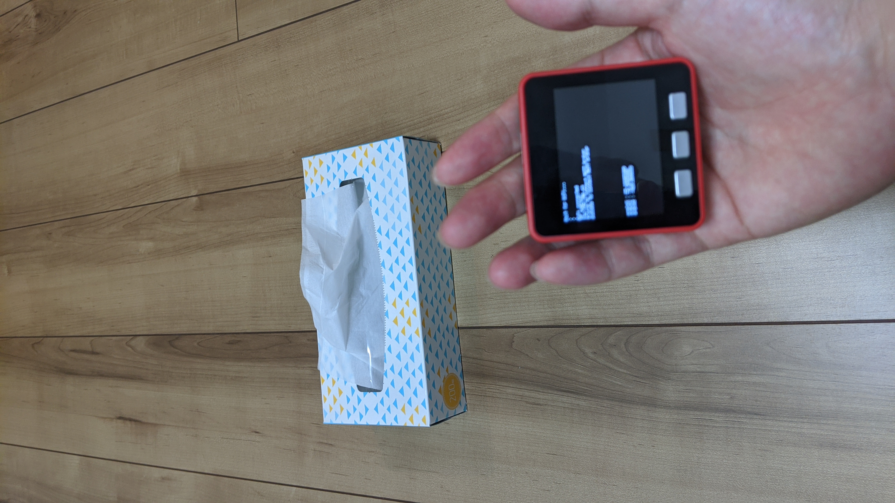

# control m5bala robot with mqtt control

## m5bala robot controller 

<!--  -->

## controller

1. setup network which includes m5stack and host pc which mqtt broker started.
1. run m5bala_mqtt and m5bala_control on m5stack with same network
1. bend arm with holding m5stack, then m5bala start moving. 
1. stretch arm, then m5bala stop.
